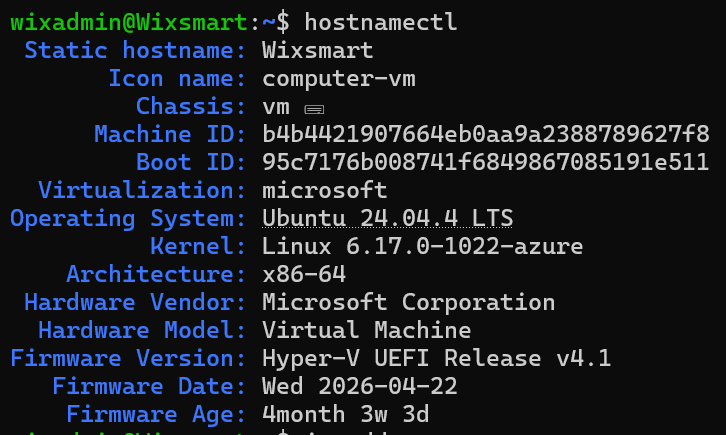
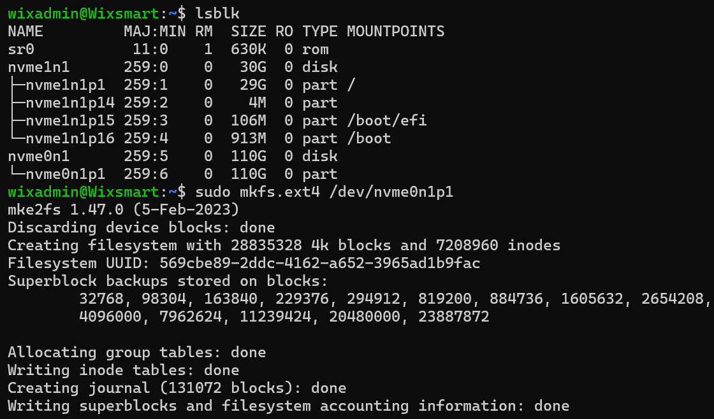
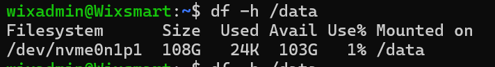
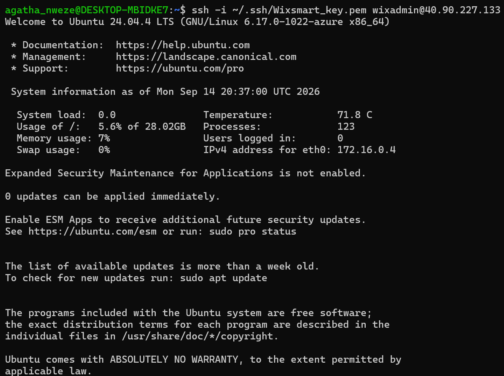
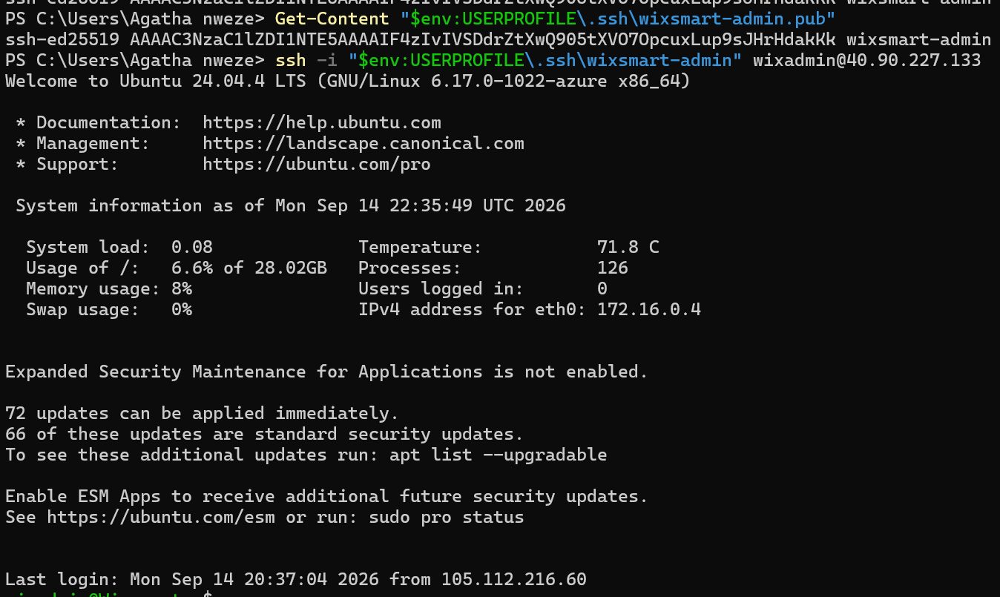
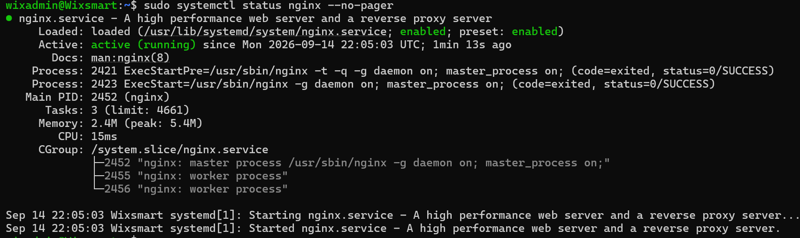
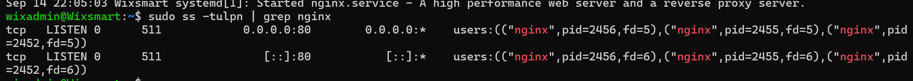
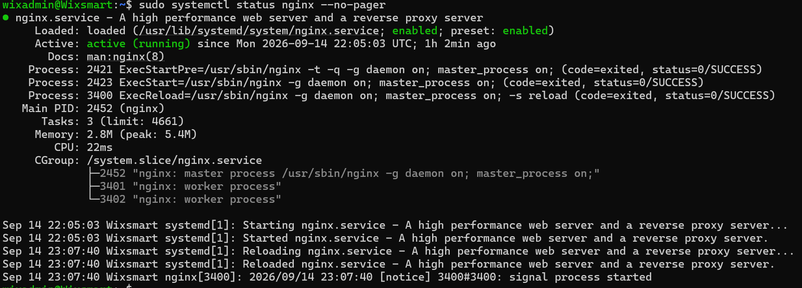
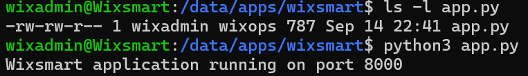
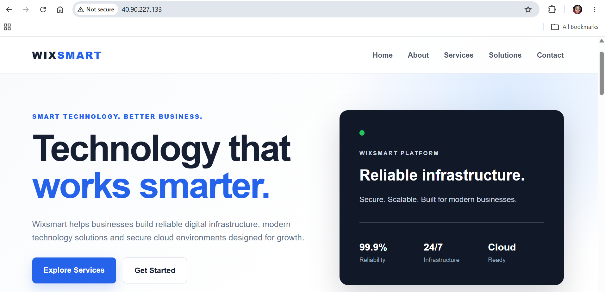

# Azure Wixsmart Linux Deployment

## Overview

A hands-on Azure Linux infrastructure project built around a realistic Linux server deployment scenario. The environment demonstrates Azure VM provisioning, SSH administration, managed data-disk configuration, Nginx web server deployment, network security configuration, and hosting a professional Wixsmart website.

> **Note:** This lab was inspired by a requirement to deploy a custom RHEL 8.7 image on Azure. The implementation in this repository uses **Ubuntu Server 24.04 LTS** to demonstrate the same core Linux infrastructure and administration skills. A custom RHEL ISO was not deployed in this lab.

## Architecture

- **Cloud:** Microsoft Azure
- **Region:** East US
- **Resource Group:** `RG-Wixsmart-Linux`
- **Virtual Machine:** `Wixsmart-Linux-01`
- **Operating System:** Ubuntu Server 24.04 LTS
- **Virtual Network:** `VNet-Wixsmart`
- **Subnet:** `Linux-Subnet`
- **Network Security Group:** `NSG-Wixsmart-Linux`
- **Web Server:** Nginx
- **Access:** SSH using an Ed25519 key pair
- **Web Port:** TCP 80
- **SSH Port:** TCP 22
- **Data Disk:** 110 GB, formatted as ext4 and mounted at `/data`

## What Was Implemented

### 1. Azure Linux VM

Provisioned an Ubuntu Linux VM in Azure and configured secure administrative access using an SSH public key.

### 2. Linux Storage

Configured a separate managed data disk for application data:

```text
/dev/nvme0n1p1 → /data
Filesystem: ext4
Size: 110 GB
```

The `/data` filesystem was added to `/etc/fstab` using its UUID so it can be automatically mounted after reboot.

Application directories were organized under:

```text
/data/apps
/data/backups
/data/config
/data/logs
```

### 3. Nginx Web Server

Installed and configured Nginx as the production-facing web server.

Validation included:

```bash
sudo systemctl is-enabled nginx
sudo systemctl is-active nginx
sudo ss -tulpn
sudo nginx -t
```

Nginx was configured to serve the Wixsmart website from:

```text
/data/apps/wixsmart/website
```

### 4. Azure Network Security

Configured the Azure Network Security Group to allow the required traffic:

| Priority | Port | Protocol | Purpose |
|---|---:|---|---|
| 300 | 22 | TCP | SSH administration |
| 310 | 80 | TCP | HTTP web access |

During testing, an HTTP connectivity issue was identified because the initial NSG rule used port `8080` instead of `80`. The rule was corrected to TCP port `80`, restoring public web access.

### 5. Professional Wixsmart Website

Built and deployed a responsive Wixsmart business website on the Azure Linux VM using HTML and CSS.

The website includes:

- Hero section
- About section
- Technology services
- Business solutions
- Contact call-to-action
- Responsive layout
- Professional navigation and styling

## Project Validation

The completed environment was validated by confirming:

- ✓ SSH access to the Azure Linux VM
- ✓ Separate data disk formatted and mounted
- ✓ Nginx installed and running
- ✓ Nginx enabled to start automatically
- ✓ Nginx listening on TCP port 80
- ✓ Azure NSG allowing required web traffic
- ✓ Public HTTP access to the Wixsmart website
- ✓ Professional website successfully served from the Linux VM

## Screenshots & Evidence

The following screenshots document the major stages of the deployment and provide visual evidence of the work completed.

### Azure VM & Storage

#### Azure Linux VM Overview



#### Data Disk Formatting



#### Data Disk Mounted



### Linux Administration & SSH

#### Successful SSH Access



#### SSH Access Restored During Troubleshooting



### Nginx Web Server

#### Nginx Service Running



#### Nginx Listening on Port 80



#### Nginx Web Configuration Active



### Wixsmart Application

#### Application Running



#### Final Professional Wixsmart Website



A PDF version of the final website preview is also included in the repository:

[View the Wixsmart website PDF](wixsmart-professional-homepage%202.pdf)

## Key Skills Demonstrated

- Microsoft Azure
- Linux Administration
- Ubuntu Server
- Azure Virtual Machines
- Azure Networking
- Network Security Groups (NSG)
- SSH
- Linux Storage Management
- Filesystem Mounting
- Nginx
- Web Server Administration
- HTML/CSS
- Linux Troubleshooting
- Infrastructure Validation

## Limitations

This project intentionally documents what was actually implemented. It does not claim deployment of the original RHEL 8.7 custom ISO, and RDP/xrdp was not configured as part of this lab.

## Future Improvements

Potential production-oriented extensions include:

- HTTPS with a domain and TLS certificate
- Custom RHEL image deployment
- Automated provisioning with Terraform
- Configuration management with Ansible
- Monitoring and alerting with Azure Monitor
- Backup and recovery configuration

## Project Goal

The goal of this project was to build practical, portfolio-ready experience with Azure Linux infrastructure, server administration, networking, troubleshooting, and web server deployment using a realistic cloud support scenario.
